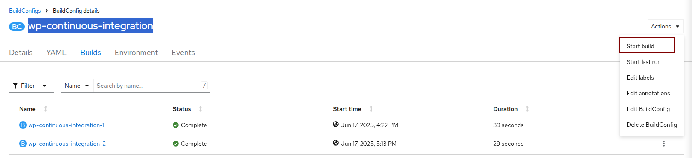

# wp-continuous-integration
WP Continuous Integration for PR images builds with Tekton

## Local
- For the first time, do `npm install`
- Connect to OpenShift
- `npm start`

## To deploy a new version
From wp-ops: `wpsible -t wp.continuous-integration.rebuild`
or:
- go into the [buildConfig/wp-continuous-integration](https://console-openshift-console.apps.ocpitst0001.xaas.epfl.ch/k8s/ns/svc0041t-wordpress/buildconfigs/wp-continuous-integration/builds) and start build:

- open the [deployment/wp-continuous-integration](https://console-openshift-console.apps.ocpitst0001.xaas.epfl.ch/k8s/ns/svc0041t-wordpress/deployments/wp-continuous-integration/pods) and delete the current pod

